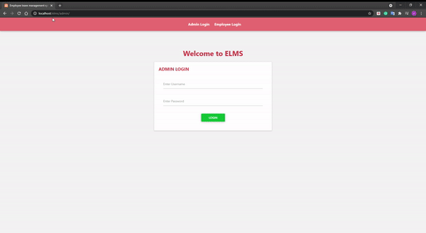
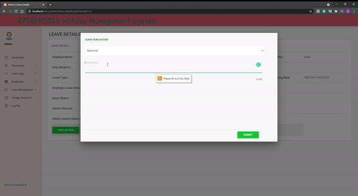
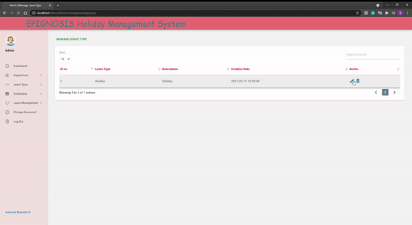
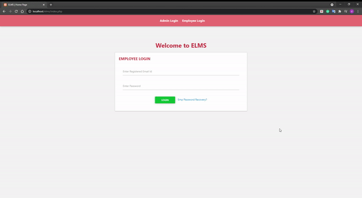
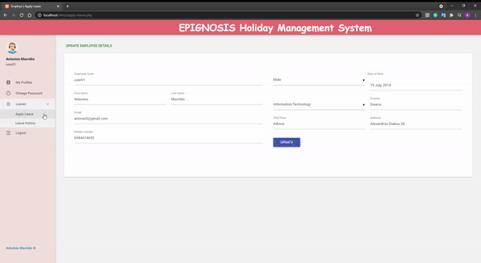

# Holiday_Management_System
The purpose of this project is to create an online holiday management program.

## Overview
The purpose of this project is to create an online holiday management program. The Employee Holiday Information Management System was designed to automate the employee administration and management and the strategic planning of leaves for employees. This program manages all of the employee records. The system was developed primarily to handle information about the employee. That serves as an instrument for better management. The key goal of this project is to create an effective web-enabled framework that would be able to simplify workplace knowledge management needs. It is meant to simplify the current manual framework for fast information collection, produce statistical reports and act as a data archive for efficient sharing of information and possible retrieval.

### System Users
* Admin
*	Employee

### Admin Feautures
*	Admin Login.
*	Admin can also view admin dashboard.
*	Admin can change password after login.
*	Admin can add leave type.
*	Admin can update leave type.
*	Admin can delete leave type.
*	Admin can add departments.
*	Admin can update departments.
*	Admin can delete departments.
*	Admin can add an employee and also update the employee info.
*	Admin can also manage the leave application(approve and not approve).
*	Admin Logout

### Employee Feautures
*	Employee login
*	Employee can Update Profile
*	Employee can apply for leave.
*	Employee can View the leave Status
*	Forget Password Recovery
*	Update Password
*	Employee Logout

### Software Requirements
* XAMPP server
* Language Used: 
  * Front End: HTML5, AJAX, JQUERY, JAVASCRIPT, BOOTSTRAP
  * Server Language: PHP 7
  * Back End: MySQL
